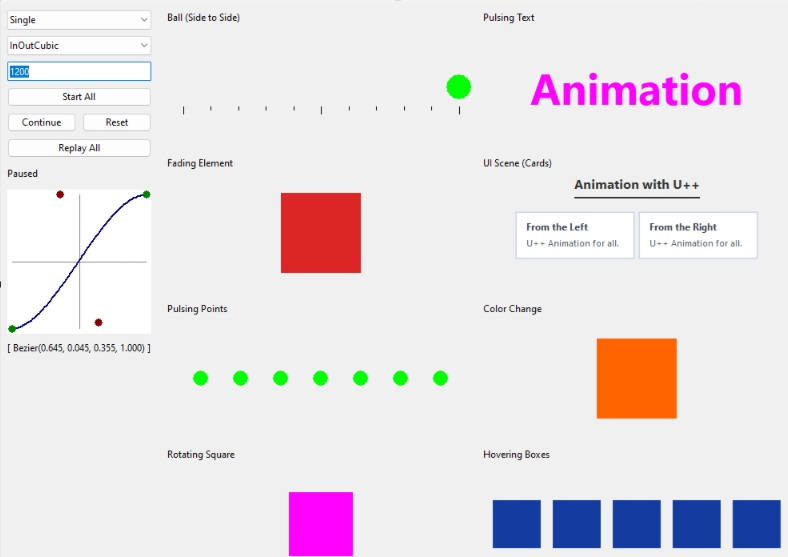

# Animation (U++ Animation Engine) — v1.0.1

Version: **1.0.1**

[](https://opensource.org/licenses/MIT)

A modern animation and easing engine for the [U++](https://www.ultimatepp.org/) C++ framework.
It provides a fluent, easy-to-use interface for creating rich, performant animations on `Ctrl`-based widgets, with deterministic memory management aligned with U++ philosophy.

Developed and originated by Curtis Edwards (DoDoBar), May 2025.

This project demonstrates how a centralized animation system can be integrated into U++, driven by a single `TimeCallback`.

---

## Features

* **Fluent Interface** – Chain methods to describe animations:
  `anim.Duration(500).Ease(Easing::OutCubic()).Play();`
* **Deterministic & Leak-Free** – Uses U++ ownership and watcher primitives for automatic cleanup.
* **Robust Lifecycle** – Supports `Pause`, `Cancel`, `Reset`, and now `Replay`, each with clear semantics.
* **Rich Easing Library** – Includes 20+ CSS-style cubic-Bézier presets plus custom cubic-Bézier curves.
* **Core Modes** – One-shot, repeated `Loop`, and `Yoyo` playback.
* **Global Control** – Stop animations targeting a control with `KillAllFor(ctrl)`.
* **Console & GUI Examples** – Demonstrations for both headless testing and live UI animation.

---

## Repository Layout

```
Animation/                  # Core library package
 ├─ Animation.cpp
 ├─ Animation.h
 └─ Animation.upp

examples/
 ├─ ConsoleAnim/            # Console probe suite
 │   ├─ ConsoleAnim.cpp
 │   ├─ ConsoleAnim.h
 │   ├─ ConsoleAnim.upp
 │   └─ main.cpp
 └─ GUIAnim/                # GUI demo with interactive widgets
     ├─ GUIAnim.cpp
     ├─ GUIAnim.h
     ├─ GUIAnim.upp
     └─ main.cpp

LICENSE
README.md
ScreenShot_GUI.jpg
```

To use in TheIDE, put the repo root into your Assembly’s *package nests*, alongside `uppsrc`. Then add `Animation` as a dependency to your main app.

---

## Quick Start

### Animate a Button on Click

```cpp
#include <CtrlLib/CtrlLib.h>
#include <Animation/Animation.h>
using namespace Upp;

struct MyApp : TopWindow {
    Button b;
    One<Animation> anim;

    MyApp() {
        Title("Animation demo");
        b.SetLabel("Click Me!");
        Add(b.CenterPos(Size(100, 40)));
        b << [=] {
            if(!anim.IsEmpty()) anim->Cancel();
            anim.Create(b);
            anim->Duration(500).Ease(Easing::OutBounce())
                ([&](double e) {
                    b.SetRect(40 + int(100*e), 40, 100, 40);
                    return true;
                })
                .OnFinish(callback([&]{ anim.Clear(); }))
                .Play();
        };
    }
};

GUI_APP_MAIN { MyApp().Run(); }
```

---

## Lifecycle Semantics

* **Pause** – reversible freeze. Animation remains scheduled and can `Resume()`.
* **Cancel** – aborts run, fires `OnCancel`, and preserves last forward progress snapshot (so `Progress()` still reports how far it got).
* **Reset** – aborts run, re-primes spec, sets `Progress=0`. This makes the same `Animation` instance immediately reusable.
* **Replay** – starts a fresh run using the *last committed spec* (the same settings you passed before the previous `Play()`). Useful for repeating an animation without re-typing setters.

`Progress()` always reports **time-normalized progress in [0..1]**.
The per-frame lambda you pass to `operator()(Function<bool(double)>)` receives the **eased value**.

---

## API Overview

### Core Methods

* `Animation(Ctrl& owner)` – construct animation bound to a control.
* `Play()` – start the animation.
* `Stop()` – stop and snap to end (Progress=1.0).
* `Pause()` / `Resume()` – reversible freeze/unfreeze.
* `Cancel()` – abort the current run, fire `OnCancel`, and preserve the progress snapshot.
* `Reset()` – abort silently, clear progress, and re-prime the object for reuse.
* `Replay()` – run again with the last-used spec. If setters were called before `Replay()`, those take priority.

### Fluent Setters

* `.Duration(int ms)` – duration in milliseconds.
* `.Ease(Easing::Fn)` – easing curve (`Easing::OutQuad()`, or custom `Bezier(...)`).
* `.Loop(int n)` – complete cycle count (`-1` for infinite; minimum finite value is 1).
* `.Yoyo(bool)` – reverse direction on each loop.
* `.Delay(int ms)` – start after delay.
* `.OnStart(...)`, `.OnFinish(...)`, `.OnCancel(...)`, `.OnUpdate(...)` – lifecycle hooks.
* `operator()(Function<bool(double)>)` – per-frame tick, gets eased `[0..1]`.

### Global Functions

* `KillAllFor(Ctrl&)` – stop all animations targeting a specific control.
* `Finalize()` – stop the shared scheduler and release all scheduled states; call it after owned animations are destroyed during explicit shutdown.
* `Tick()` / `TickOnce()` – manually advance the scheduler for deterministic tests and headless probes.

---

## Examples

* **ConsoleAnim** – automated probe suite, checks edge cases (reuse after Cancel, Reset behavior, Replay semantics, etc.).
   

* **GUIAnim** – interactive demo: animate buttons, flashing ellipses, easing curve editor.
  
  
  
  *The GUIAnim example running the animation lab with easing controls and multiple live scenes.*


The easing presets are cubic-Bézier approximations, including the presets named
`InElastic`, `OutElastic`, and `OutBounce`; they are not physically simulated
spring or collision curves. `Loop(-1)` is infinite. With `Yoyo(true)`, one loop
is a forward leg followed by a reverse leg.


---

## License

Copyright (c) 2025 Curtis Edwards (DoDoBar). This project is licensed under the
MIT License. See [LICENSE](LICENSE).

---
